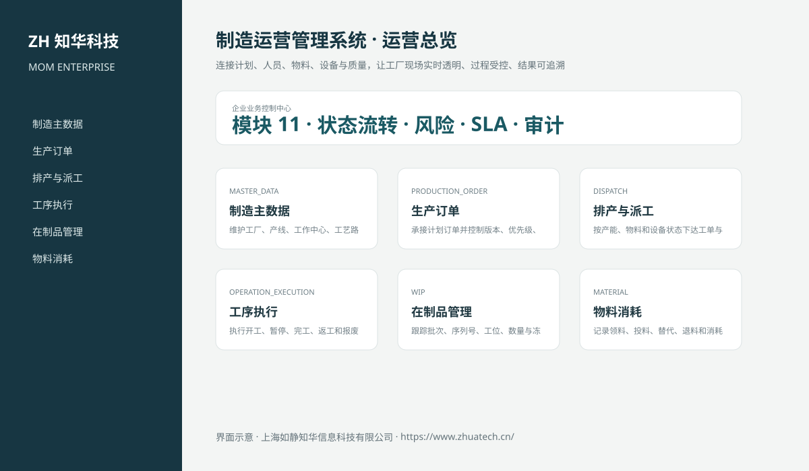
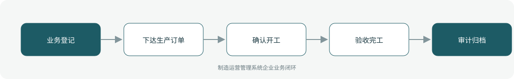

# ZhuaTech MOM

## 知华科技制造运营管理系统

把生产计划真正落实到每一条产线、每一道工序、每一个批次，并用可审计的数据连接人员、物料、设备与质量。

[知华科技官网](https://www.zhuatech.cn/)　·　[查看架构](docs/ARCHITECTURE.md)　·　[API 清单](docs/API.md)　·　[企业能力](docs/ENTERPRISE.md)　·　[测试说明](docs/TESTING.md)



### 项目定位

ZhuaTech MOM 是知华科技（上海如静知华信息科技有限公司）面向制造企业发布的企业社区源码项目。它位于 ERP 计划层与车间执行层之间，覆盖生产订单从下达、开工、执行、质量放行到完工追溯的业务闭环，并预留 ERP、MES、WMS、QMS、EAM 与工业物联网适配边界。

工程为前后端分离架构，提供桌面管理端和响应式现场业务端；示例账号、工单和统计数据均为虚构内容。

### 一张图看懂业务闭环



| 现场阶段 | 系统能力 | 管控结果 |
| --- | --- | --- |
| 准备 | 制造主数据、生产订单、物料齐套、设备状态 | 具备开工条件后再下达 |
| 执行 | 派工、工序报工、在制品、投退料、安灯 | 生产进度实时透明 |
| 放行 | 首检、巡检、末检、不合格与质量关卡 | 未放行禁止完工 |
| 收尾 | 完工验收、班次交接、批次谱系、外部回执 | 全过程可追溯、可审计 |
| 改进 | 达成率、一次合格率、停机损失和 OEE | 识别损失并持续改善 |

### 已实现的 11 个模块

1. **制造主数据**：工厂、产线、工作中心、工艺路线、班次与计量规则。
2. **生产订单**：计划承接、版本、优先级、批次、交期和订单状态流。
3. **排产与派工**：按产能、物料齐套和设备状态下达任务。
4. **工序执行**：开工、暂停、完工、返工和报废事务。
5. **在制品管理**：批次、序列号、工位、数量与冻结状态。
6. **物料消耗**：领料、投料、替代、退料和消耗差异。
7. **质量关卡**：首检、巡检、末检、不合格与放行结论。
8. **设备与安灯**：运行停机、异常呼叫、响应、恢复和原因记录。
9. **班次交接**：产量、异常、待办、物料、设备和安全事项。
10. **制造追溯**：投入批次、工序、设备、人员和产出序列号谱系。
11. **制造绩效**：产量、计划达成率、一次合格率、损失时间和 OEE。

### 不只是 CRUD

- 生产订单按“草稿 → 已下达 → 生产中 → 已完工”流转，非法越级操作返回冲突；
- ADMIN 与 OPERATOR 职责分离，敏感审批由后端强制校验；
- 领域规则实时计算完工率、良品数和 OEE，并校验物料齐套、质量放行和未关闭安灯；
- 支持唯一单号、JPA 乐观锁、幂等控制项、重复提交保护和合法状态迁移；
- 支持组合检索、分页、逾期筛选、SLA、责任人工作量、UTF-8 CSV 导出；
- 支持协作备注、操作时间线、附件 SHA-256 元数据和完整审计；
- 外部系统只保留适配器与回执模型，不内置第三方凭据；
- `prod` 配置会拒绝默认密码、弱数据库口令和不安全跨域来源。

### 技术栈与目录

```text
zhuatech-mom/
├── backend/       Java 21 · Spring Boot · Security · JPA · Validation
├── frontend/      Vue 3 · Vite · 响应式管理端/现场端
├── docs/          架构、API、企业能力、测试和产品图片
├── compose.yaml   MySQL 8 + 后端 + Nginx 前端
└── .github/       Issue 模板、PR 模板和 CI
```

Java 工程坐标为 `cn.zhuatech`，业务包名为 `cn.zhuatech.mom`。开发测试使用 H2，生产数据库使用 MySQL 8。

### 本地启动

```bash
cd backend
mvn test
mvn spring-boot:run

# 新终端
cd frontend
npm install
npm run dev
```

也可以一次启动完整环境：

```bash
cp .env.example .env
docker compose up --build
```

演示账号为 `admin / admin123` 和 `operator / operator123`。这些凭据仅用于本地演示，生产部署必须通过环境变量全部替换。

### 自动化验收

后端测试覆盖产品元数据、认证授权、记录 CRUD、重复编号、状态机、审计、检索、CSV、SLA、幂等控制项、职责分离、附件校验、外部回执、MOM 领域决策和生产配置安全门禁；前端通过依赖审计与生产构建验证。

```bash
cd backend && mvn test
cd ../frontend && npm ci && npm run build
docker compose config
```

### 使用许可与商业授权

Copyright © 2026 上海如静知华信息科技有限公司。

本工程仅允许个人学习、研究和非商业技术交流，**不得用于商业用途**。企业内部使用、生产部署、SaaS 运营、项目交付、品牌替换、收费培训、咨询实施或再分发，均须事先获得上海如静知华信息科技有限公司书面授权，详见 [LICENSE](LICENSE)。

需要深度开发、私有化部署、系统集成或制造数字化咨询，请访问[知华科技官网](https://www.zhuatech.cn/)或扫码联系：

| 微信咨询一 | 微信咨询二 |
| --- | --- |
|  |  |

关键词：制造运营管理系统、MOM 系统、MOM 开源项目、生产管理系统、工序管理、在制品管理、安灯系统、制造追溯、OEE、Java 企业系统、Vue 管理系统、知华科技、上海如静知华信息科技有限公司。
